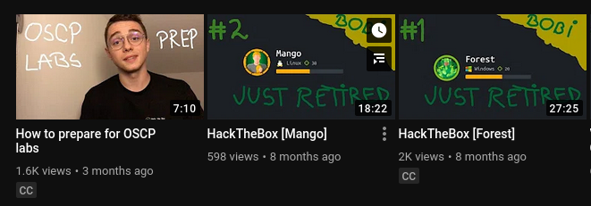

# bobi Whacked

## solution:

googling bobi whacked we can see that bobi has a youtube channel 

* in the about section we see a hex string **6D6964646C6570617274** which translate too middlepart 

* notice that the task description mention about caption 

* notice the added translation by the user in 2 videos 

* follow this video and get the first and last part of the flag https://www.youtube.com/watch?v=7M2WWXGd5nE