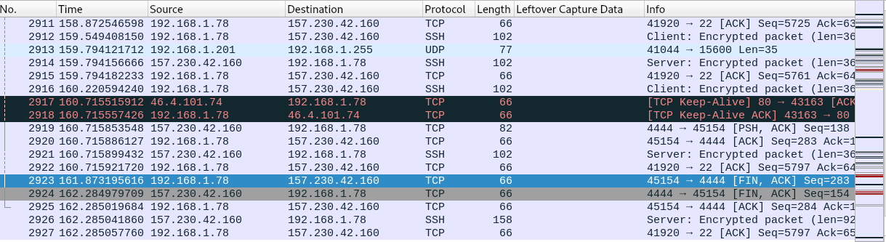
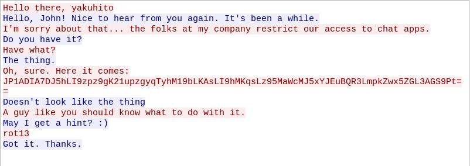

# conversation

## solution:

i checked all the tcp streams until i found this one

following the stream we can see the discussion

apply rot13 on the base64 string and then decode you get the flag

