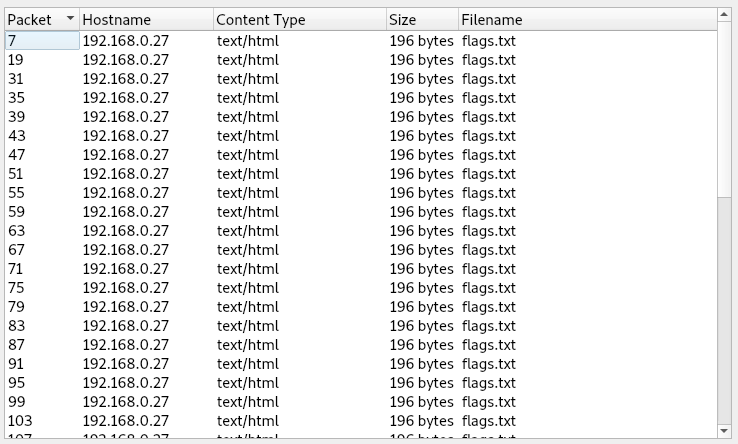
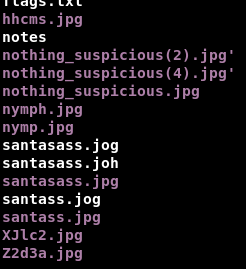
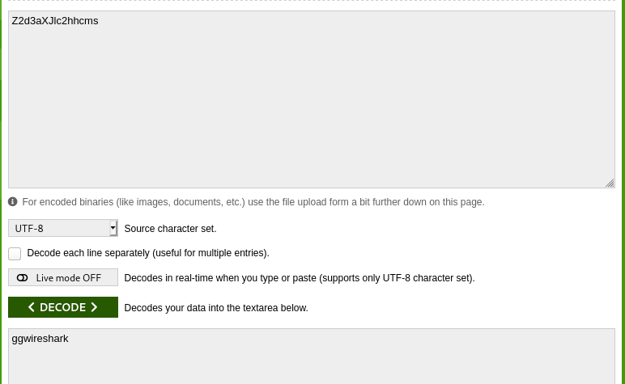

# santass

##solution:

we have a pcap file with a lot of http request . the first thing todo is to dump those files 

we get a lot files that look like each other and even the content isn't interesting.

after a lot of false paths i noticed that the file names can create a base64 string

i tried different combination until i got this one 

